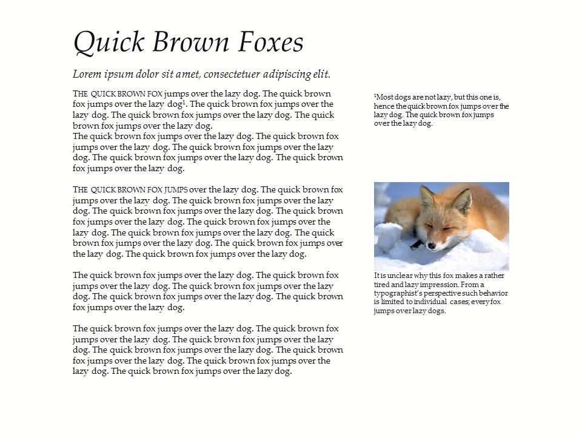

ppTufte - A Tufte-Style PowerPoint plugin
=========================================

ppTufte is a quick VBA hack enables you to use Office 2010 to efficiently
generate slides that mimick the handout style of Edward Tufte.

Why would someone do this?
--------------------------

In the corporate world, slides are being misused to document things that should
be written down in a document. The bullet point-heavy slideument is a painful
reality. And it needs to be weeded out.

However, as [others have argued before](http://www.duarte.com/slidedocs/), our
ways of corporate communication are changing: decision makers have limited time
at their disposal and breaking dowm complex matters in well-structured,
efficiently digestable and engaging documents has become crucial. It seems that
neither presentation slides nor text documents are the best way to go.

So it won't do to declare PowerPoint evil, it
won't do to sneer upon those who use it and it won't do to dream up a vision
without providing a path towards it (I love LaTeX, but the majority of people
in the corporate world have a hard time understanding why WYSIWYG is
semi-professional).

*ppTufte* attempts to facilitate the generation of slide
documents, i.e. slides that are more suitable for documentation, pre-read and
post-meeting handouts than presentation slides. Slides that enable people to
share their thoughts in full sentences and enable readers to process these
thoughts efficiently.

Long story short, all *ppTufte* does is to provide a few macros that should
make it easier for people to share information based on a clear and (somewhat)
beautiful design without requiring them to learn a new tool.

I am perfectly aware that this is a poor man's effort to better and more
informative communication -- the full-fledged design-type way is quite probably
to follow [Nancy Duartes slidedoc idea](http://www.duarte.com/slidedocs/) (if
you have the necessary resources at your disposal, that is ;-).

Installation Guide
------------------

* import code into VBA editor
* save as ppam file (e.g. pptufte.ppam) in your add-on folder
* activate add-in

How to use ppTufte
------------------

The basic building block of the tufte design is a standard text box.
You provide the text box content and the macros will format the content
according to Tufte's handout rules.

The easiest way to get to know the existing macros is to test them out.

### General

*Important:* ppTufte will not change your fonts; I recommend to switch the presentation text
style in the Layout ribbon to `Palatino Linotype` for Serif Fonts.

### Buttons

* Create slide: this creates a new slide using a slightly adjusted contrast.
* Make canvas: this either creates a new canvas text box on the active slide or
  makes the selected textbox a canvas text box. In both cases, the canvas text
  box is placed below the lowermost known canvas element.
* Make title: creates a new title text box or makes the selected text box a
  title box.
* Make subtitle: creates a new subtitle text box or makes the selected text box
  a subtitle box.
* Make margin note: creates a new margin note from highlighted text (empty if
  no highlighting present) or makes the selected text box a margin note.
* Make referenced margin note: creates a new margin note from highlighted text
  and inserts a reference at the beginning of the selection.
* Make canvas figure: formats an existing image/figure to fit the canvas (in
  width) and adds a figure caption. Also reformats a group of object & caption
  to fit the canvas
* Make margin figure: same as a canvas figure, only for the margin.
* Autolayout canvas elements: converts all selected elements to canvas elements
  and aligns them top-down on the canvas.
* (Autolayout margin) (TODO)

### Configuring ppTufte

Configuration options are stored in the `GetConfig` function.
In order to change the config, you currently need to edit the code and
re-install the plug-in.

License
-------
MIT, see `LICENSE` file and source code.

Limitations and Frustrations
----------------------------

* Developed and (roughly) tested under Office 2010 only. If you are a proficient
  .NET developer and feel like bringing this to later versions of Office,
  please go ahead!
* Currently only tested with 4:3 slides; other formats should scale but may
  look strange
* The PPT VBA interface does not allow to set up kerning. The PPT default
  behavior is to kern starting from 12pt, thus the margin notes are currently
  not kerned.
* In his later books, Tufte starts major paragraphs with a few words in small
  caps. As there is no programmatic access to the new font interface introduced
  in Office 2010, you need to do this manually.
